<div align="center">

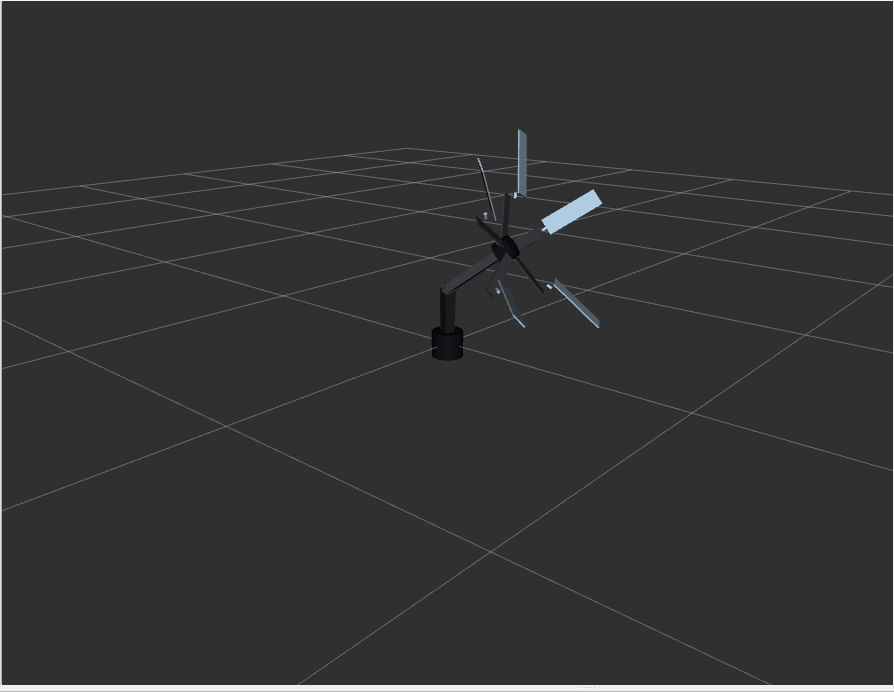

# ODRADEK
### Surgical Assistant Robot

*A desk-mounted robotic arm designed to reduce surgeon fatigue and streamline the operating environment*

[](https://docs.ros.org/en/jazzy/)
[](https://gazebosim.org/)
[](https://moveit.ros.org/)
[](https://ubuntu.com/)
[]()

</div>

---

## Overview

**Odradek** is a 17-DOF shoulder-mounted robotic manipulator engineered to operate within a surgeon's personal workspace. It handles non-operative tasks, instrument handovers, dynamic lighting, workspace management, so the surgical team can stay focused on what matters.

The system is fully simulated in **ROS 2 Jazzy** and **Gazebo Harmonic**, with physics-validated kinematics, MoveIt 2 motion planning, and a complete `ros2_control` actuation stack. The hardware integration path is kept open by design.

> **Current state:** Simulation-complete. Full-stack trajectory execution validated in Gazebo with MoveIt 2 IK and ros2_control. Physical hardware integration is the next milestone.

---

## Roadmap

| Status | Milestone |
|--------|-----------|
| ✅ | URDF/XACRO model with 17-DOF kinematics |
| ✅ | Physics simulation in Gazebo Harmonic |
| ✅ | `ros2_control` actuation + anti-gravity holding torque |
| ✅ | MoveIt 2 motion planning + numerical IK (KDL) |
| ✅ | Full-stack Gazebo ↔ RViz trajectory execution |
| ✅ | Parallel petal grasping mechanism |
| 🔲 | Physical hardware prototype |
| 🔲 | Voice command interface |
| 🔲 | Instrument detection and handover |
| 🔲 | Procedure recording and playback |
| 🔲 | Real-time surgeon intent prediction |

---

## System Architecture

The project is structured as three integrated layers:

```
┌─────────────────────────────────────────────┐
│           Motion Planning Layer             │
│   MoveIt 2 · KDL IK · Collision Avoidance  │
├─────────────────────────────────────────────┤
│             Control Layer                   │
│  ros2_control · JointTrajectoryController   │
│  JointStateBroadcaster · gz_ros2_control    │
├─────────────────────────────────────────────┤
│            Physical Model Layer             │
│   URDF/XACRO · Inertial Parameters         │
│   Gazebo Harmonic Physics Engine            │
└─────────────────────────────────────────────┘
```

---

## Design Evolution

The manipulator went through three design iterations before reaching its current architecture.

### Phase 1: Foundational Serial Kinematics

<div align="center">
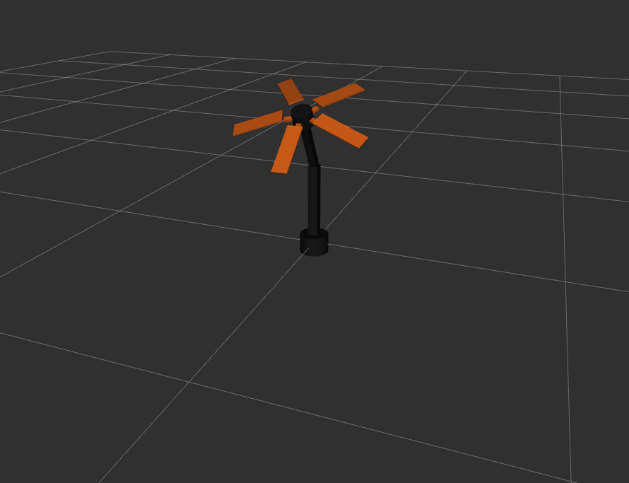 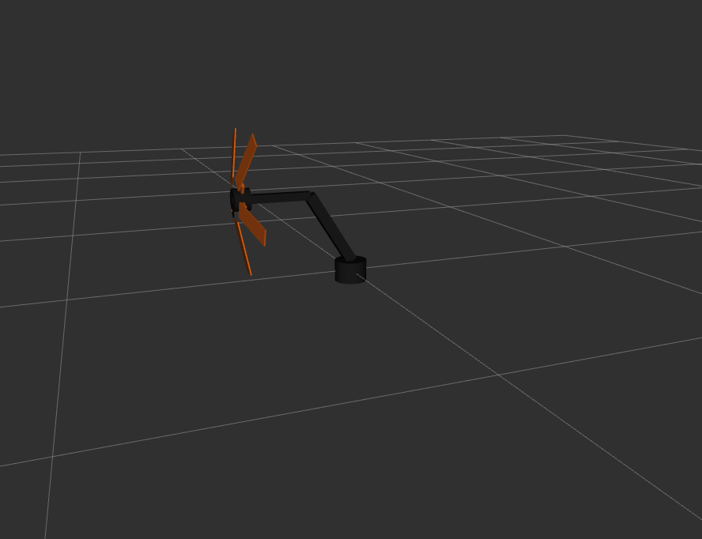 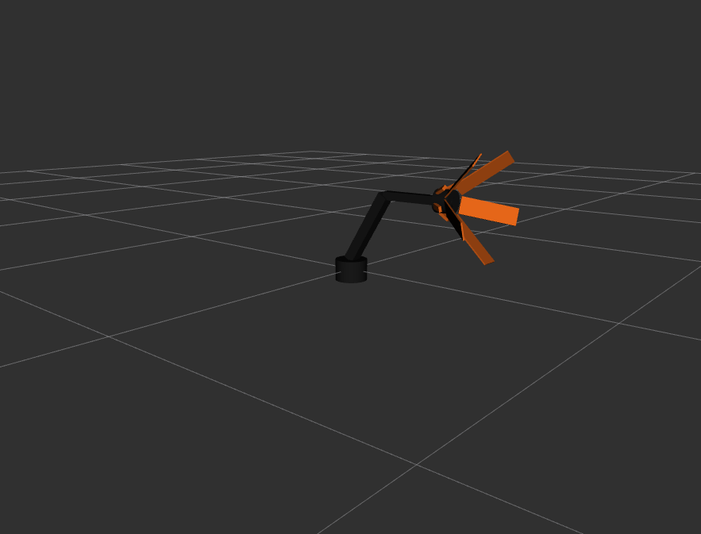
</div>

A 4-DOF serial chain: shoulder yaw → upper arm pitch → elbow pitch → static tool hub. This phase validated URDF syntax, basic forward kinematics in RViz2, and the XACRO inertial calculation macros.

---

### Phase 2: High-DOF Dexterity and Parallel End-Effector

<div align="center">
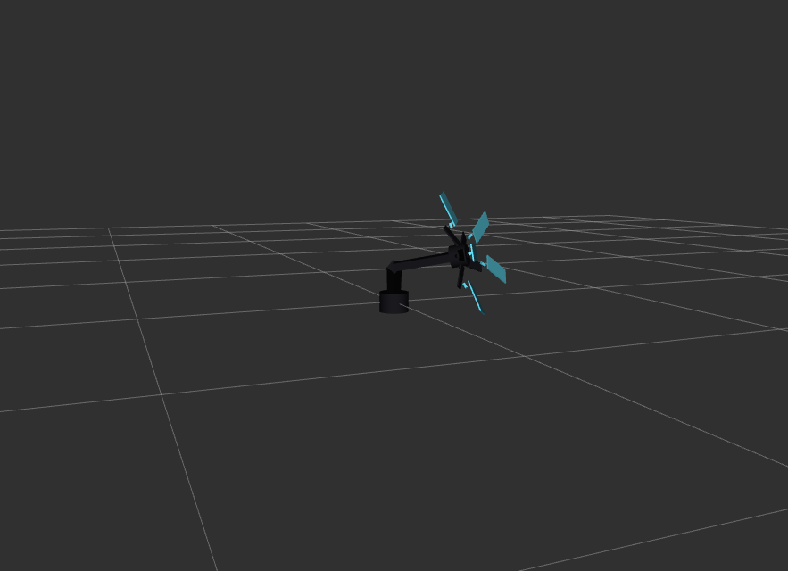 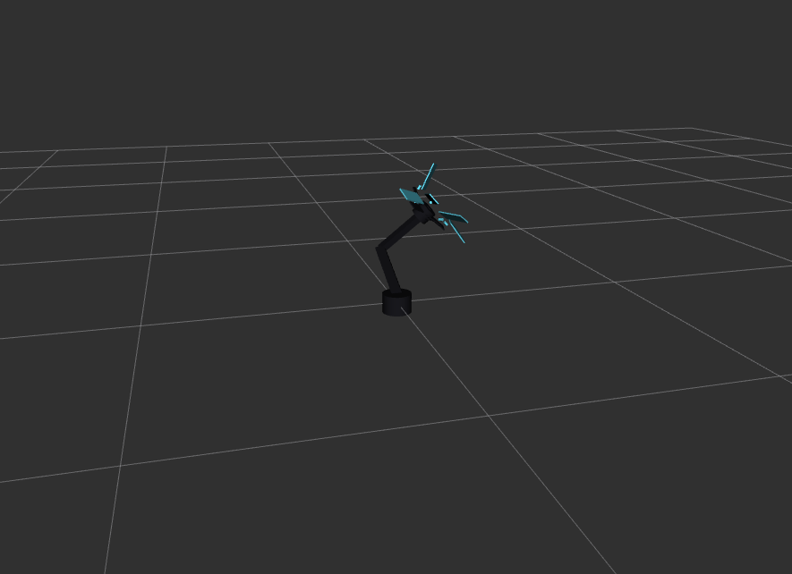 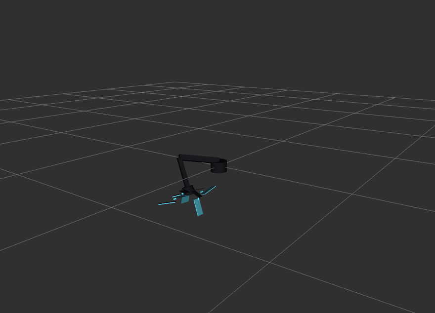
</div>

The architecture was upgraded to **17 DOF**. Single-axis joints were replaced with 3-axis spherical joints (Yaw-Pitch-Roll) via zero-mass dummy links. The end-effector became a parallel mechanism: five radially distributed petals, each with an inner and outer link, closing around a central optical hub.

---

### Phase 3: Grasping Optimization and Final Proportions

<div align="center">
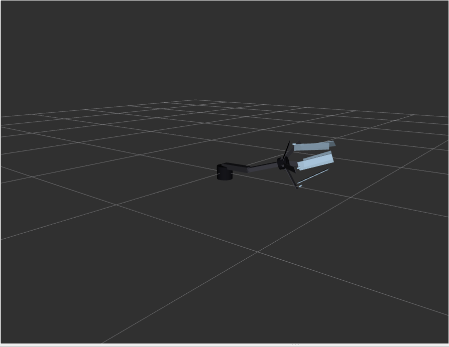 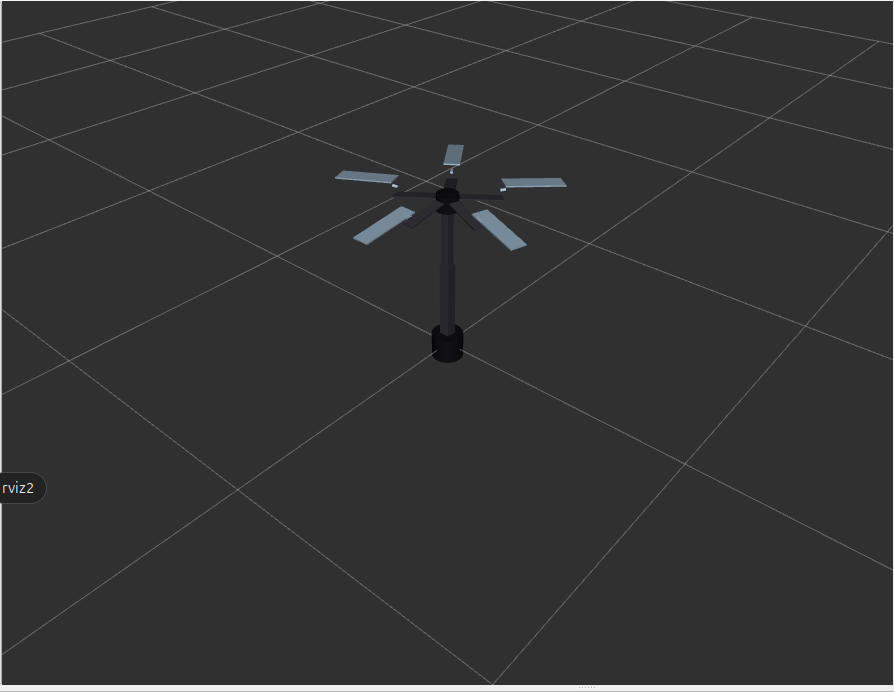 
</div>

Petal dimensions were tuned for realistic form-closure grasping of standard medical instruments:

- **Inner link:** `0.16 m`
- **Outer link:** `0.22 m`

Collision geometries and mass/inertia parameters were added to every link to stabilize the Gazebo physics engine.

---

## Physics Simulation

### Dynamics Failure (Expected)

<div align="center">
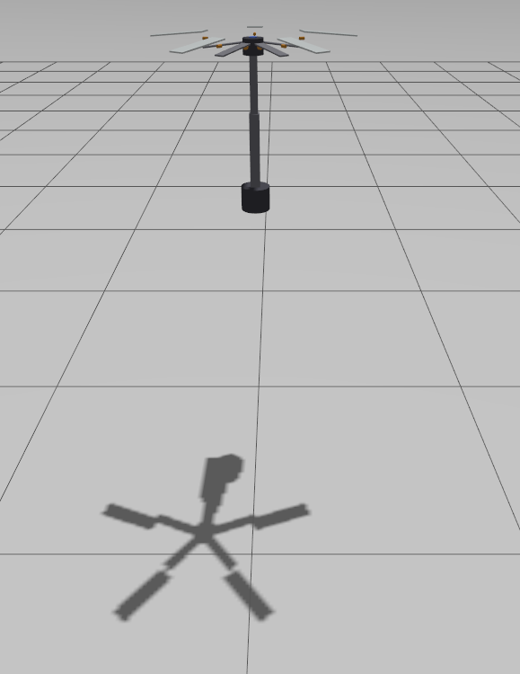 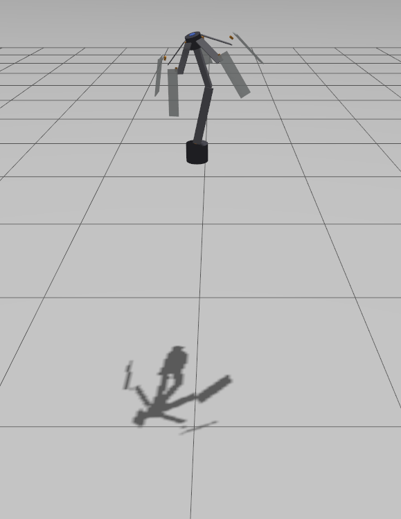 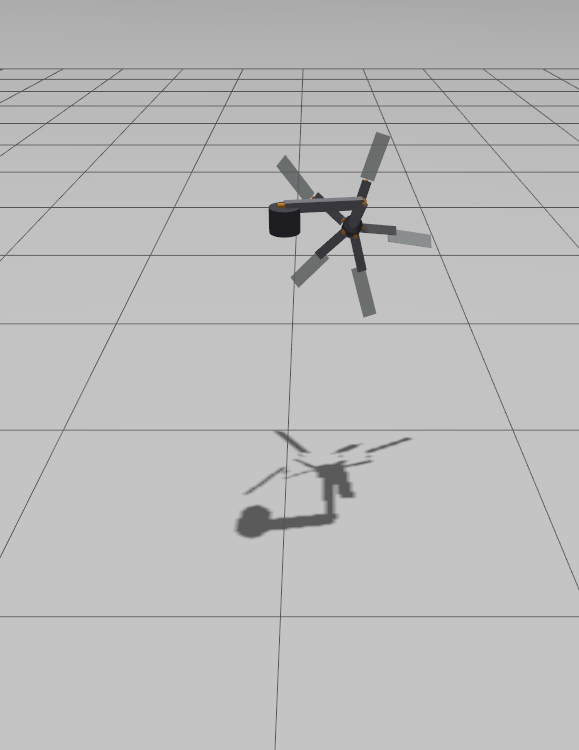 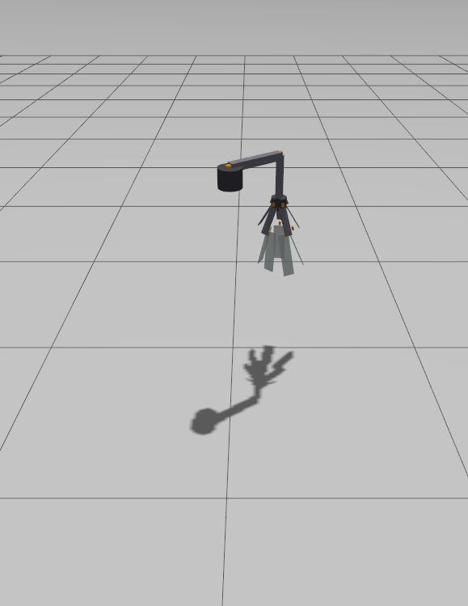
</div>

The unactuated model predictably collapsed under 9.81 m/s² gravity. This confirmed that the inertial parameters were correctly defined, the model behaves like a real object. It also established the hard requirement for active joint control.

### Stable Actuation with ros2_control

<div align="center">
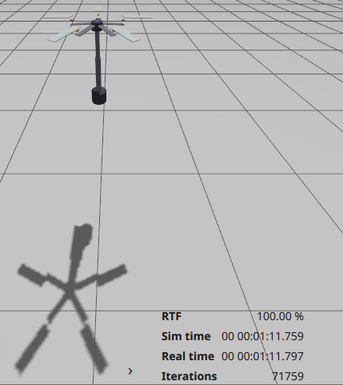
</div>

After integrating `ros2_control`, the 17-DOF arm held a rigid posture indefinitely under Earth gravity. The simulation log above shows **1 minute 11 seconds** of continuous stable operation, validating the anti-gravity holding torque from the `JointTrajectoryController`.

---

## Motion Planning

MoveIt 2 integration was configured using the **MoveIt Setup Assistant** with the following architecture:

| Component | Configuration |
|-----------|--------------|
| IK Solver | KDL Kinematics Plugin (Jacobian-based numerical IK) |
| Arm Planning Group | `odradek_arm`: 7-DOF gross positioning chain |
| Gripper Planning Group | `odradek_gripper`: 10-DOF parallel petal mechanism |
| Self-Collision Matrix | 10,000 sample high-density generation |
| Default Pose | `home_position`: zero-state joint configuration |
| End-Effector Link | `scanner_hub` (terminal link of arm chain) |

### Full-Stack Trajectory Execution

<div align="center">
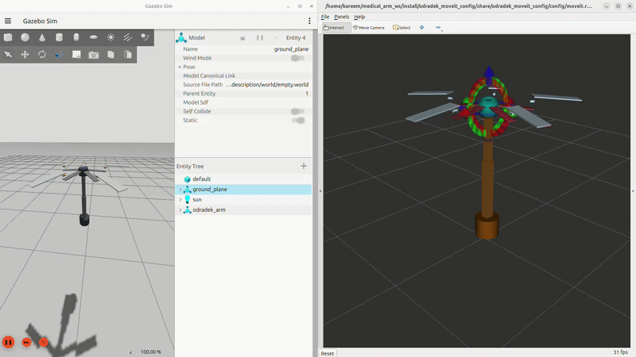
</div>

<div align="center">
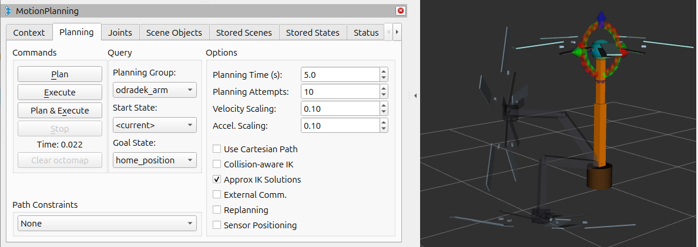
<br/>
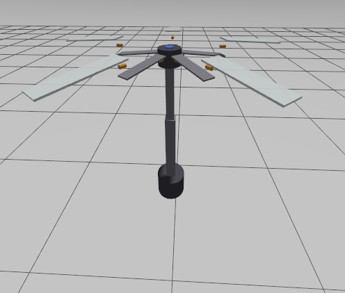 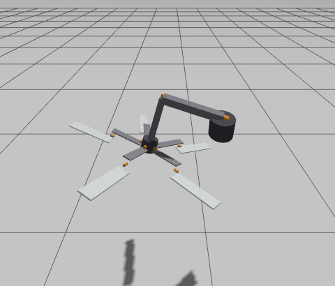
</div>

MoveIt generates a trajectory in RViz, which is bridged to Gazebo via `ros_gz_bridge`. The `ros2_control` hardware interfaces execute the joint commands in the physics engine. Three integration challenges were resolved to get here:

1. **Kinematic Singularity:** The home position (all joints at 0°) caused Jacobian rank loss. Fixed by enabling approximate IK and introducing a slight initial end-effector rotation.
2. **Simulated Time Synchronization:** MoveIt and Gazebo ran on different clocks. Fixed by publishing Gazebo's `/clock` topic to the ROS 2 network and injecting `use_sim_time:=true` into all nodes.
3. **Partial Hardware Execution:** MoveIt sent 7-joint trajectories to a controller expecting all 17. Fixed by enabling `allow_partial_joints_goal`, allowing the arm to move while petals maintain holding torque.

---

## Grasping Mechanism

<div align="center">
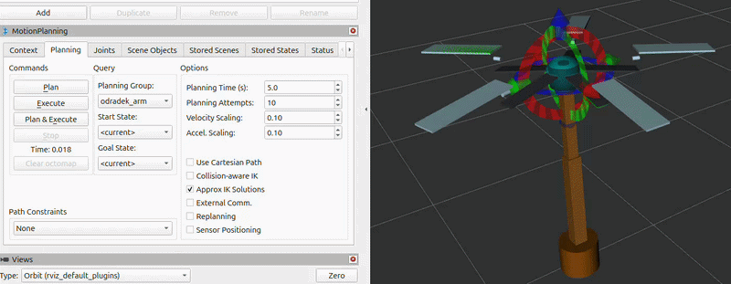
</div>

<div align="center">
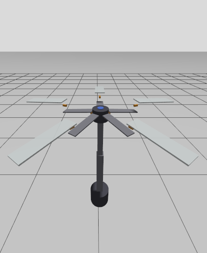 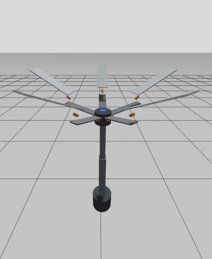 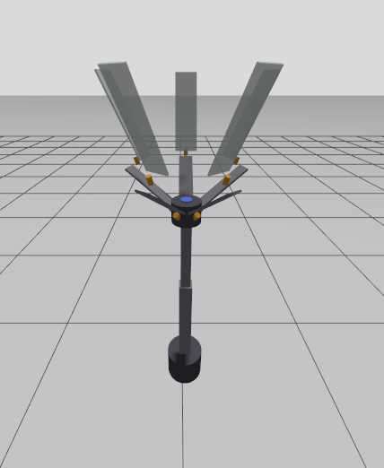 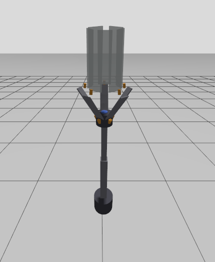
</div>

Two programmatic grasping states are defined:
- **`gripper_open`:** petals flared to maximum clearance
- **`gripper_closed`:** petals contracted for form-closure grasping

Both states are executable as single commands, providing the foundation for future high-level control sequences.

---

## Getting Started

### Prerequisites

- Ubuntu 24.04
- ROS 2 Jazzy
- Gazebo Harmonic
- MoveIt 2
- `ros2_control`, `gz_ros2_control`

### Installation

```bash
# Create and build the workspace
mkdir -p ~/medical_arm_ws/src
cd ~/medical_arm_ws/src
git clone https://github.com/<your-username>/odradek-surgical-robot.git

cd ~/medical_arm_ws
rosdep install --from-paths src --ignore-src -r -y
colcon build
source install/setup.bash
```

### Launch

```bash
# Launch in RViz (kinematics only)
ros2 launch odradek_description display.launch.py

# Launch full simulation in Gazebo with ros2_control
ros2 launch odradek_description gazebo.launch.py

# Launch MoveIt 2 motion planning
ros2 launch odradek_moveit_config move_group.launch.py
```

---

## Project Structure

```
odradek-surgical-robot/
├── odradek_description/
│   ├── urdf/
│   │   └── med_arm.urdf.xacro       # Main robot model
│   ├── launch/
│   │   ├── display.launch.py
│   │   └── gazebo.launch.py
│   └── config/
│       └── controllers.yaml
├── odradek_moveit_config/
│   ├── config/
│   │   ├── kinematics.yaml
│   │   ├── joint_limits.yaml
│   │   └── odradek.srdf
│   └── launch/
│       └── move_group.launch.py
└── docs/
    └── media/
```

---

<div align="center">
<sub>Named and Modeled after the fictional multi-limbed scanner from <em>Death Stranding</em>, a machine built to navigate difficult terrain so its operator doesn't have to.</sub>
</div>
